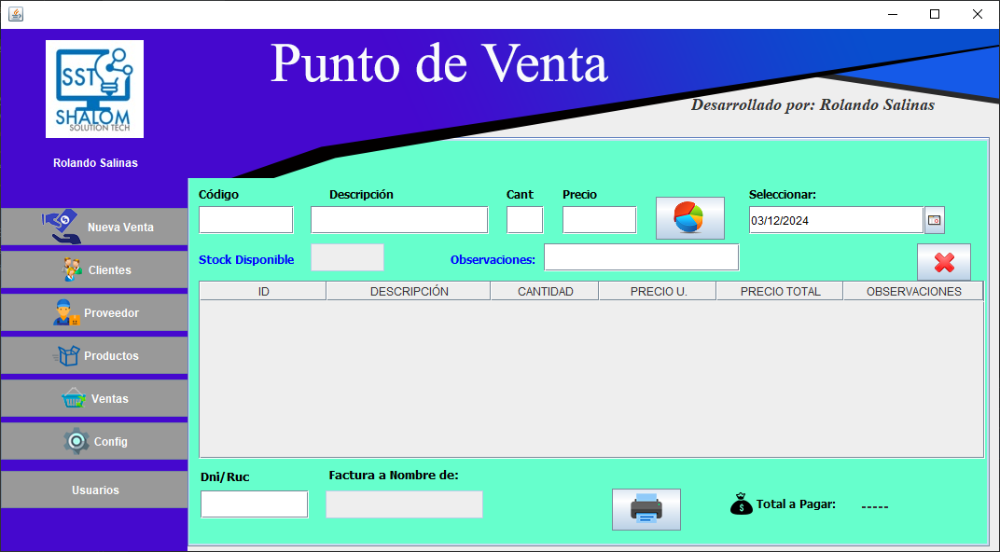

# Sistema de Venta en Java y Mysql

El proyecto "Sistema de Venta en Java y MySQL" es una aplicación diseñada para gestionar el proceso de ventas y mantener un control de inventario en una tienda o negocio. El proyecto está desarrollado utilizando el patrón de diseño de software MVC (Modelo-Vista-Controlador), que permite separar las diferentes capas de la aplicación y facilitar su mantenimiento y extensibilidad.

# Funcionalidades principales
<ul>
<li><b>Registro de facturas:</b> El sistema permite el registro de facturas de venta, donde se pueden añadir productos, especificar la cantidad vendida y calcular el total de la venta. Además, se generan registros de todas las transacciones realizadas.</li>

  <li><b>Sistema de inventario:</b> El sistema incluye un módulo de inventario que se encuentra integrado con una base de datos MySQL. Permite llevar un registro de los productos disponibles, su cantidad, precio y otra información relevante. Al registrar una venta, se actualiza automáticamente el inventario.</li>

<li><b>Gestión de clientes:</b> El sistema permite mantener un registro de los clientes, donde se puede almacenar información como nombre, dirección, número de contacto, entre otros. Esto facilita el seguimiento de los clientes y la generación de facturas.</li>
<li><b>Gestión de proveedores:</b>  El sistema también permite la gestión de proveedores, donde se puede almacenar información sobre los proveedores, como nombre, dirección, número de contacto, entre otros. Esto facilita el seguimiento de los proveedores y la realización de pedidos de productos.</li>
<li><b>Generación de reportes:</b> Se incluye la funcionalidad de generar reportes y estadísticas relacionadas con las ventas y el inventario. Estos reportes pueden ser útiles para tomar decisiones empresariales y analizar el rendimiento del negocio.</li>

<li><b>Seguridad y autenticación:</b> El sistema cuenta con un sistema de autenticación para garantizar que solo los usuarios autorizados puedan acceder a las funciones del sistema. Esto protege la información sensible y mantiene la integridad de los datos.</li>
</ul>

# Tecnologías utilizadas

<ul>
<li><b>Java:</b> El lenguaje de programación principal utilizado para el desarrollo del proyecto.</li>
<li><b>MySQL:</b> Base de datos utilizada para almacenar y gestionar los datos del sistema.</li>
<li><b>JDBC (Java Database Connectivity):</b> API de Java utilizada para interactuar con la base de datos MySQL.</li>
<li><b>Framework MVC:</b> El proyecto sigue el patrón de diseño Modelo-Vista-Controlador, que ayuda a separar las responsabilidades de la aplicación y mejorar su mantenibilidad.</li>
</ul>

  # Instrucciones de uso
  <ol>
<li><b>Clonar el repositorio:</b> Descarga o clona el repositorio del proyecto desde GitHub a tu máquina local.</li>
